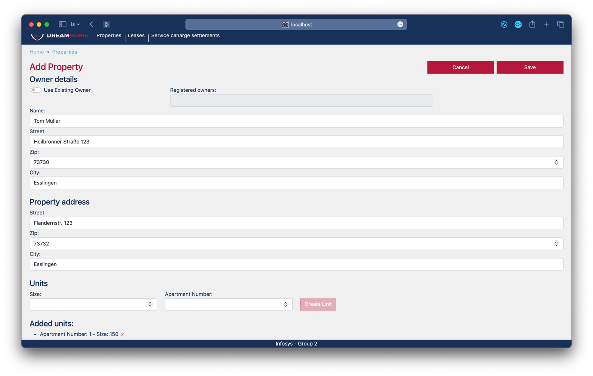

# Information Systems SS2023 Lab - Group 2

## Introduction

This semester's project in Information Systems laboratory realizes a platform to manage Service Charge
Settlements for the fictional company DreamHome, introduced in the lectures.

### Members of the project group 2
| Name             | email                                                       |
|------------------|-------------------------------------------------------------|
| Buehl, Dennis    | [debuit00@hs-esslingen.de](mailto:debuit00@hs-esslingen.de) |
| Eraslan, Yasin   | [yaerit00@hs-esslingen.de](mailto:yaerit00@hs-esslingen.de) |
| Fesko, Robert    | [rofeit00@hs-esslingen.de](mailto:rofeit00@hs-esslingen.de) |
| Kloos, Christian | [chklit00@hs-esslingen.de](mailto:chklit00@hs-esslingen.de) |
| Mehlmann, Arthur | [armeit00@hs-esslingen.de](mailto:armeit00@hs-esslingen.de) |

## Content
### Backend
This Repository includes an express backend server. It is only used to make the connection to the
database and manipulate and retrieve data by calling stored procedures or sending SQL statements.

As an interface to the front end application
it provides an API which is implemented in frontends [db-SDK](./frontend/src/db-SDK.js).

### Database
The Database folder contains SQL scripts for creating the tables. It also contains the code for the
stored procedures and triggers used for this project.

### Documentation 
This directory only stores images used for this readme and a sample report generated with our application.

### Frontend
This Repository includes the source code of the frontend application, realized as a Vue.js 
web-application. The application is used to present the Data to the user and gives the opportunity
to import account statements as [csv](./testing/Transactional-Accounting-Data.csv) and export a service
charge settlements [report as pdf](./documentation/sampleReport.pdf).

### Presentation
Here you can find our [demo video](./presentation/applicationDemo.mov). The video explains the core functionality of the
application.

It starts with  droping all tables, automatically initializing the database with creating the tables, triggers and 
populate some tables with data to have some data to show and work with.

Then there will be a .csv uploaded including the accounting data to be proccessed by the trigger.
With this data available a report is generated.

### Testing
The testing folder contains a [csv file](./testing/Transactional-Accounting-Data.csv) containing account statements.
The file should be used for testing the application.

## Instruction

As mentioned the application consists of the MS-SQL Server database, an express server and a 
vue app. The database is run on the university's itnt0005 MS-SQL Server. Therefor a connection to 
the universities network is necessary.

### Run the express backend
From this repositories root directory run the following command from a terminal:
```sh
cd ./backend && npm install && node app.js
```

### Run the vue app
From this repositories root directory run the following command from a terminal:
```sh
cd ./frontend && npm install && npm run dev
```
After starting the app the web app can be found [here](http://localhost:5173).

## Description of the UI
The UI is supposed to be intuitive. Nevertheless, there are some core functionalities that are
not available on the home page. For example the forms for manipulating data - which is implemented
for properties - and the download of service charge settlements.

### Navigation elements
Main navigation element is the navbar at the header of the application. The logo takes you back to the 
home page.

On many pages there will be breadcrumbs at the top of the pages body. Clicking one of the items will
lead you back to the pages.

For most of the lists shown on the pages clicking an item will lead you to a new page showing further
details of the item.

### Home page
On the home page which is also the landing page you can find three tables showing all properties,
all leases and all service charge settlements. By clicking one of the tuples a detailed view of the
item is shown in a new view.

At the bottom of the page there is a button and a file input field that takes .csv files including
account statements. For the structure of the file [see this example](./testing/Transactional-Accounting-Data.csv).
This example can be found in the testing directory of this repository and can be used for testing.
Clicking the button will make the app read the file and send the data to the database, where it will be
processed.


### Properties view
When navigating to the properties view - for example by using the navbar - you will land on this page.
Here you can see the same table as already shown on the home page. By clicking an item you will get
to the details view of that property.

In the top right corner you will find a button called Add property. This button will lead you to a new
view handling the creation of a new property.


### Add property
To add a property there is more data affected than the property data itself. A property owner is 
needed and we also want to add units to the property here. 

For adding an owner there are two options that can be chosen with the help of the toggle button.
The first option is to choose an owner that already exists. There are no limitations on how many 
properties an owner can hold.
The second option is to create a new owner. Therefor there is a form for entering the owner's details
such as name and address. By toggling the other object than selected is disabled.

The next part of the form is for entering the address of the property to create.

The last part is for adding units. Units have the attributes size in m<sup>2</sup> and an apartment
number.
After clicking create unit the unit is listed below the units section of the form. Multiple units can
be added to the property. Every line in the list of units comes with an *x* icon which removes it from 
the list.

By clicking save the data will be persisted to the database and you will be redirected to the properties
overview. Cancel will not make any changes on the database and will redirect you.



### Property details
To get to the details list, click one of the properties in the property table.On this page the
details of the selected property are shown. 

There is information about the owner, the properties address and a list of all units. By clicking one
of the units you will be redirected to the unit's detail view.

The button in the top right corner leads you to a page to edit this property.


### Edit property
In comparison to the add forms there are less options implemented here. For editing a property there
are just options for changing the owner to another owner that's already in the system. There is no 
option to create a new owner. Also there is no option to change the units.

the fields of the form are prefilled with the actual data of the property. To change it, just change
the text of the input fields or select a new owner from the dropdown and click save.

After saving the changes you will be redirected to the property's details page. Cancel will redirect you
directly.


### Service charge settlements view
This view shows a list of all service charge settlements. Are service charges settlement is generated
for every year and every unit with assigned service charges. 
By clicking on of the items you will be redirected to the overview page of the scs.


### Service charge settlement detail view
This view shows a list of all service charges that are part of the selected service charge settlements.
The overview shows the details of the unit related to the scs and the tenant that has lived there during
this period.

In the top right corner there is a button for downloading a service charge settlements report.
The report is generated as pdf and the browsers default downloads handling takes care of it.


In the documetation directory you can also find a [sample report](./documentation/sampleReport.pdf).

### Other views
There are more views that are not mentioned here. At the leases section you can find a list of all
leases. As for all list clicking an item redirects to a detailed view of the item.

If you click on a unit in the units list, that can be found in the property detail view, you will be
shown a view with the details of the unit and a list of all service charge settlements, rent payments
and leases.
